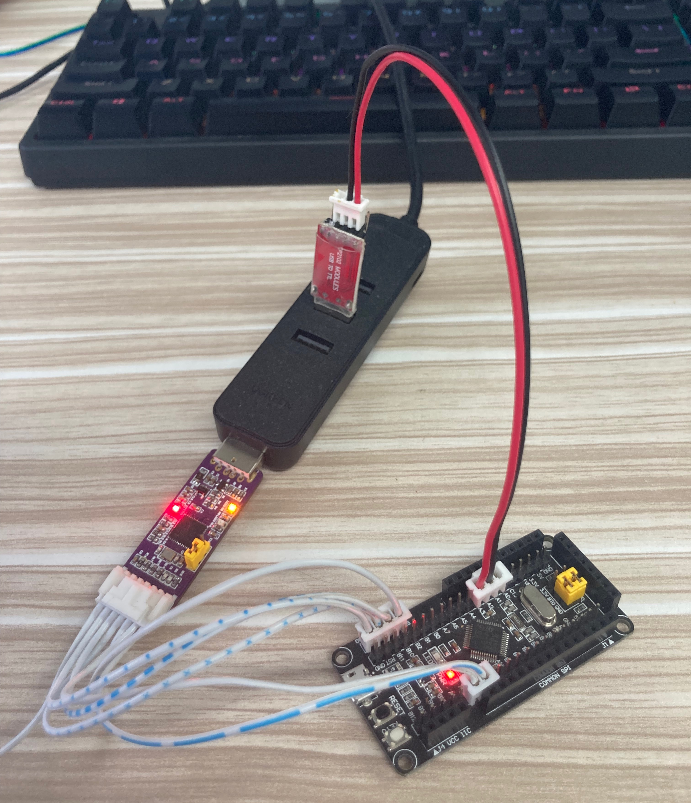

# stm32F1xxbootloader
## 简介
    这是一个设计用于stm32f1系列mcu的IAP启动引导程序。固件文件传输移植hal_modem框架，采用标准的YMODEM-1K协议通过串口传输数据。

    stm32f103c8t6应用举例，编译环境KEIL_5.36 编译器armclang 6.16。
    内存分配如下：
| 内存分配 | 地址 | 大小 |
| :---: | :---: | :---: |
| Bootloader | 0x08000000---0x08003000 | 10kb |
| Application | 0x08003000---0x08010000 | 54kb |
## 使用方法
1. 设置hal_modem_config_t，调用hal_modem_start()启动hal_modem。
```c
/* 应用配置举例 */
hal_modem_config_t config = {
        .role = YOMODEM_1K_RECEIVER,
        .offset = ApplicationAddress
    };

hal_modem_handle_t handle = hal_modem_start(&config);
    if(!handle){
        LOGI("hal_modem_start Failed\n");
    }
```
2. 将hal_modem_machine_run()接口放置于频率大于200Hz的循环中（中断中不支持）。
```c
while(1) {
        hal_modem_machine_run(&handle);
    }
```   
## 测试
1. 下载安装Seiralport串口Ymodem调试软件
<https://www.lab-z.com/ymodem-%E4%B8%B2%E5%8F%A3%E6%B5%8B%E8%AF%95%E8%BD%AF%E4%BB%B6>
2. 连接示意

3. Log
```
Stm32F1xxOtaBootloader Beginning !
*******
01 00 ff 52 6c 64 43 68 61 72 67 65 00 32 39 39 36 00 00 00 00 00 00 00 00 00 00 00 00 00 00 00 00 00 00 00 00 00 00 00 00 00 00 00 00 00 00 00 00 00 00 00 00 00 00 00 00 00 00 00 00 00 00 00 00 00 00 00 00 00 00 00 00 00 00 00 00 00 00 00 00 00 00 00 00 00 00 00 00 00 00 00 00 00 00 00 00 00 00 00 00 00 00 00 00 00 00 00 00 00 00 00 00 00 00 00 00 00 00 00 00 00 00 00 00 00 00 00 00 00 00 33 d5 
*************** HAL MODEM CONNECTED ********
******** HAL MODEM STARTING RECVING FILE ********
*******
02 01 fe ...
*******HAL_MODEM WRITE DOWN AT: 0x08003000 
*******
02 02 fd ... 
*******HAL_MODEM WRITE DOWN AT: 0x08003400 
*******
02 03 fc ...
*******HAL_MODEM WRITE DOWN AT: 0x08003800 
*******
04 
*************** HAL MODEM RECVING FILE COMPLETED ********
*******
04 
**************
01 00 ff 00 00 00 00 00 00 00 00 00 00 00 00 00 00 00 00 00 00 00 00 00 00 00 00 00 00 00 00 00 00 00 00 00 00 00 00 00 00 00 00 00 00 00 00 00 00 00 00 00 00 00 00 00 00 00 00 00 00 00 00 00 00 00 00 00 00 00 00 00 00 00 00 00 00 00 00 00 00 00 00 00 00 00 00 00 00 00 00 00 00 00 00 00 00 00 00 00 00 00 00 00 00 00 00 00 00 00 00 00 00 00 00 00 00 00 00 00 00 00 00 00 00 00 00 00 00 00 00 00 00 
*************** HAL MODEM FINISHED ********
Application run
Application run
Application run
```